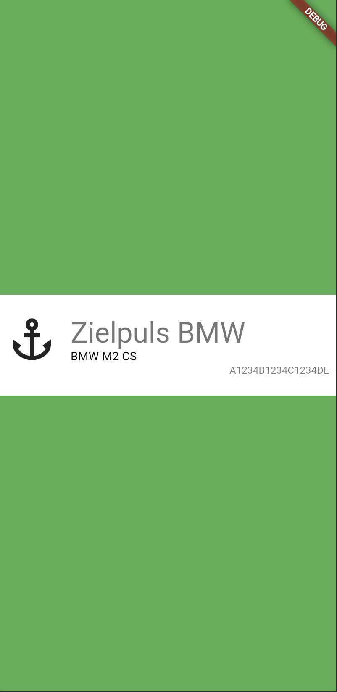
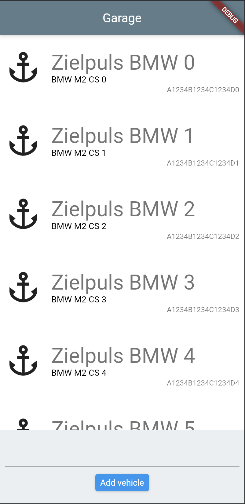
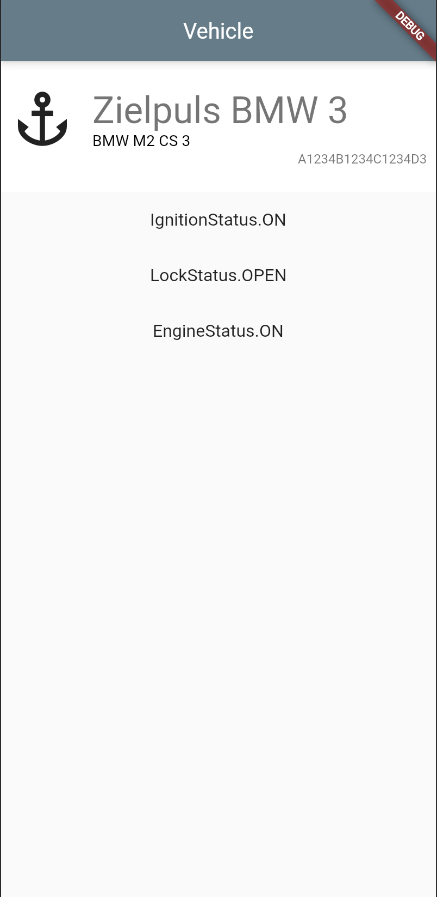

# garage_app

Flutter project for practice.

# Testing

## What are pros and cons of tests?

## What types of tests are there?

## What are different approaches to writing tests? Pros & cons?

## What are the pros and cons of TDD?

# Widget Tests

## Task 1: VehicleListItem

**VehicleListItem**

- takes Vehicle (lib/model/vehicle.dart) as required input
- height: 120.0
- width: fill space
- InkWell (splashColor: Colors.yellow, highlightColor: Colors.yellow)
- Padding: 8.0 all sides

**Icon**

- size: 60
- horizontal space between icon and display name, brand model specifier: 16.0
- Icon should be Anchor

**Display Name**

- text aligned left
- style: headline4
  - fontSize
  - weight
  - family
  - color

**Brand Model Specifier**

- text aligned left
- style: subtitle2

**Display Name** top + **brand model specifier** bottom should be aligned with **icon** top and bottom

**Vin**

- text aligned right
- style: caption

**TIP**:

- use Row and Column for alignment, not text properties

## Task 2: GarageScreen

**AppBar**

- title: "Garage"
- backgroundColor: Colors.blueGrey

**Stack with 2 layers**

- **back layer**:

  - ListView.builder with 10 VehicleListItems (set the text values according to their index - no need to test this mock data)
  - full height, full width
  - scrollable

- **front layer**
  - widget to add vehicles
  - height 120
  - width: fill
  - padding 8.0
  - TextField
  - ElevatedButton "Add vehicle" under TextField
  - ElevatedButton has padding 8.0
  - background color is Colors.blueGrey[50]

## Task 3: VehicleScreen

- Requires vehicle (lib/model/vehicle.dart) upon construction
- Requires vehicleState (lib/model/vehicle_state.dart) upon construction

**AppBar**

- title: "Vehicle"
- backgroundColor: Colors.blueGrey

**Body**

- VehicleListItem as first item of body

- ListView as second item of body
  - contains new Widget of type VehicleStateListItem
  - render a VehicleStateListItem for each VehicleState member

**VehicleStateListItem**

- padding 16
- displays value of one vehicleState Member
- text orientation: center
- text style: subtitle1

**TIPS**

- use the shrinkwrap property on the ListView otherwise it won't render
- Think about whether you want to use a static ListView instead or a ListView.builder

# Unit Tests

## Task 4: GarageDataProvider

- ~~implement according to spec in lib/data_provider/garage_data_provider.dart~~

## Task 5: GarageRepository

- implement according to spec in lib/repository/garage_repository.dart

## Task 6: VehicleStateDataProvider

- ~~implement according to spec in lib/data_provider/vehicle_state_data_provider.dart~~

## Task 7: VehicleStateRepository

- implement according to spec in lib/repository/vehicle_state_repository.dart

## Task 8: GarageBloc

- define states and events for GarageBloc
- implement the features
- GarageBloc should be able to cover the following features:

  1. **Load owned vehicles** Upon an event loads the ownedVehicles from the GarageRepository and emits a new state containing them
  2. **Reload owned vehicles** Upon an event reloads the ownedVehicles from the GarageRepository and emits a new state containing them
  3. **Load owned vehicles** While the GarageBloc is loading, a state shall be emitted so UI knows to show a loading indicator
  4. **Add vehicle by vin** An event can be added to the BLoC containing a VIN that results in the BLoC
     - preparing a Vehicle object with a generated model and displayName
     - emitting a state to indicate that it is currently trying to add a vehicle
     - calling addVehicle on the GarageRepository
     - emitting a state with the vehicles that have been returned from the GarageRepository
     - if the GarageRepository threw an error, emit an error state with the known ownedVehicles

**TIP**:

- GarageDataProvider has a delay so the loading states can be properly tested
- **yield** is amazing to emit multiple states while reacting to a single event

## Task 9: Connect GarageBloc to UI

- instantiate a BlocProvider in the widget tree above the GarageScreen
- use a (or multiple) BLoC-Builder(s) to consume the state in the GarageScreen and react to state changes
- when instantiating the screen add the corresponding event to the BLoC from UI to trigger the initial load of ownedVehicles
